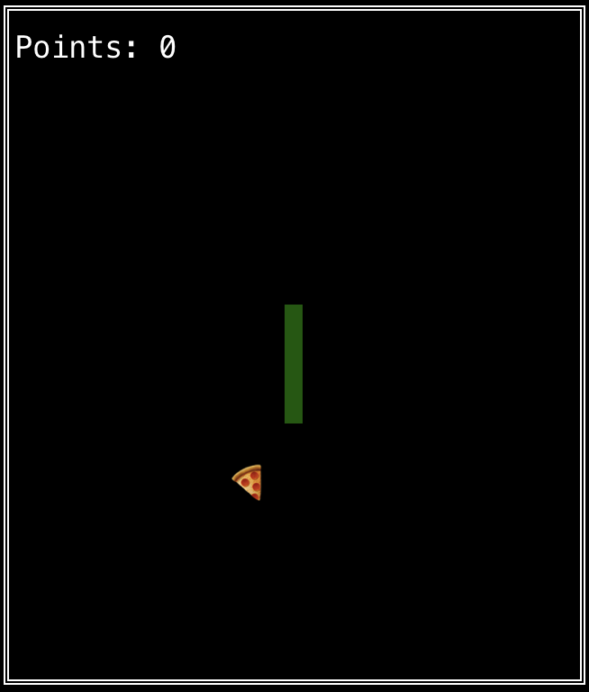
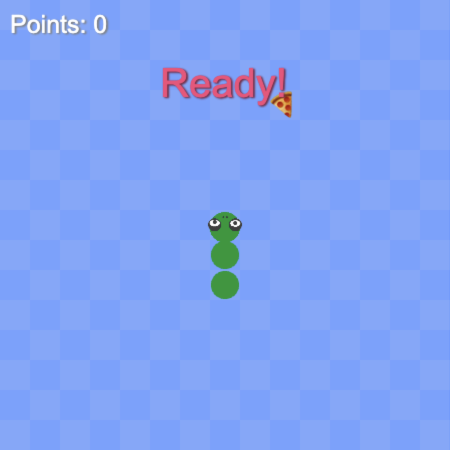

# Go & WebAssembly Demonstrations

 


## Demo 1
### Hello World in the Frontend
In this demonstration, we showcase a simple "Hello World" application running in the web browser. By leveraging Go and WebAssembly, we're able to run compiled Go code directly in the browser. This example serves as a basic introduction to using Go and WebAssembly together to build frontend applications.

```shell
cd helloworld-web
just test
```

## Demo 2
### Hello World in the Backend
This demo represents a "Hello World" example, but this time on the server-side.

```shell
cd helloworld-backend
just test
```

## Demo 3
### Performance Comparison: Go (WebAssembly) vs JavaScript
This demonstration focuses on comparing the performance between Go compiled to WebAssembly and a JavaScript function. I've written a function in Go that generates the nth prime number and implemented the same logic in JavaScript.

By invoking both functions with the same input and measuring the time taken to generate results, we can analyze the performance difference between a WebAssembly-based Go application and a native JavaScript application.

This demo serves as a practical experiment in understanding the computational efficiency of WebAssembly and Go in relation to traditional JavaScript in a browser environment. It showcases the potential benefits of leveraging WebAssembly for computationally heavy tasks in web development.

```shell
cd performance
just start
```

## Demo 4
### Snake Game
The Snake Game is an exciting showcase of how a game engine can be used both in terminal-based and web-based environments.

* The game is initially programmed to run in a terminal. This highlights Go's ability to create interactive terminal applications. It involves the implementation of game logic, user input handling, and terminal graphics rendering.

* Then, by harnessing the power of WebAssembly, we repurpose the same game engine to run in a web browser. This demonstrates the portability and reusability of Go code. It further underlines the value of WebAssembly, enabling high-performance web applications by running compiled code directly in the browser.

```shell
cd snakegame
just play-terminal

#or

just play-web 
```
